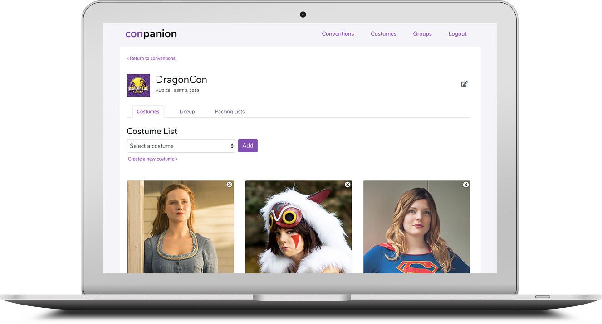
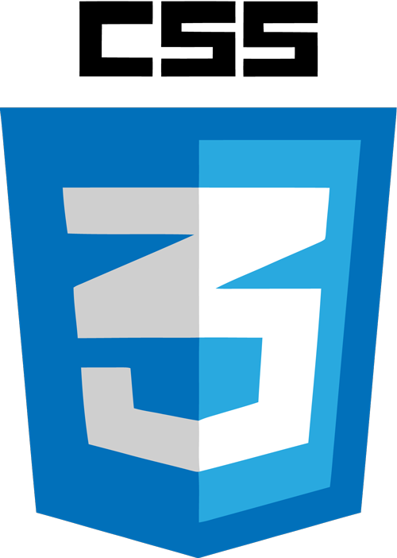
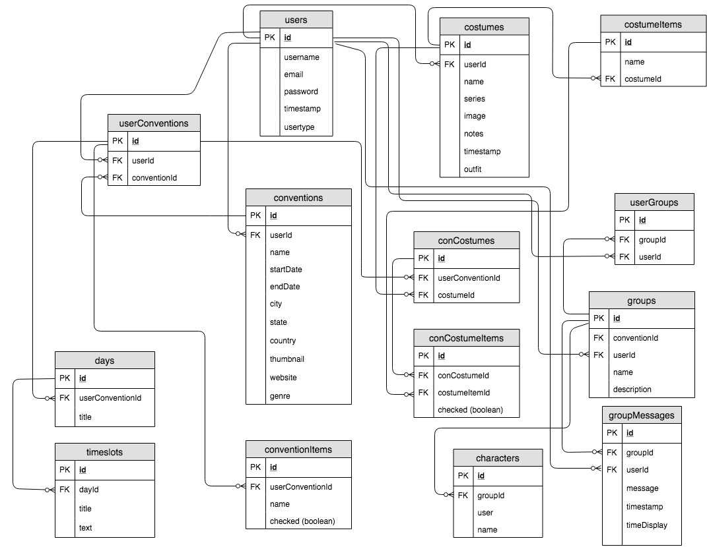

# ConPanion
ConPanion is a single-page convention-planning application intended for cosplayers and costumers. In this app, a user can make a list of conventions they’re attending, create costume pages, and participate in groups. For each convention, the user can add their planned costumes, manage packing lists, and create a lineup/calendar.

## Testing Locally
To run ConPanion locally:

1. Clone this repo: `git clone git@github.com:megcruzen/capstone_conpanion.git`
1. To install all libraries and their dependencies, run `npm install`
1. In the /api directory, run `json-server -p 5002 -w database.json`
1. Run `npm start` in root directory to start react server

## Planning and Creation
### Technologies Used
&nbsp;&nbsp;&nbsp;&nbsp;&nbsp;&nbsp;&nbsp;&nbsp;&nbsp;&nbsp;&nbsp;&nbsp;&nbsp;&nbsp;&nbsp;&nbsp;&nbsp;&nbsp;&nbsp;&nbsp;&nbsp;&nbsp;&nbsp;&nbsp;&nbsp;&nbsp;&nbsp;&nbsp;

### ERD

